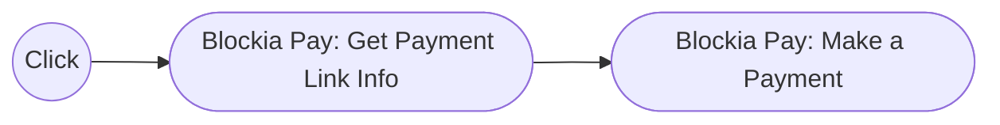

# Blockia Pay n8n Node

The Blockia Pay n8n Node integrates the Blockia Agent SDK into n8n, enabling
decentralized, automated crypto payments inside your workflows. This node allows
users to make payments, fetch wallet balances, and fetch payment links info
securely using the same underlying logic as the Blockia Pay platform.

## N8N Node Overview

Blockia Pay provides a seamless bridge between the Blockia Agent SDK and n8n's
visual automation system. With this node, you can automate payment flows, check
wallet balances, and handle link-based payment requests directly from your n8n
workspace without manual interaction or third-party connectors.

## Installation Guide

### NPM Installation

Follow the official
[n8n community node installation guide](https://docs.n8n.io/integrations/community-nodes/installation/).

After installing n8n locally, open a terminal and run:

```bash
cd ~/.n8n/custom
npm install n8n-nodes-blockia-pay
n8n start
```

Once n8n restarts, you'll see Blockia Pay listed among your available nodes.

### N8N Configuration

1. Launch n8n and open your workflow editor.
2. Go to **Settings → Community Nodes** and enable installation if not already
   active.
3. Install the package: `n8n-nodes-blockia-pay`
4. Restart n8n to apply the configuration.
5. In a new workflow, search for **Blockia Pay** in the node list and drag it
   into your canvas.

## Credentials Setup

The Blockia Pay Node does not use n8n credential types. Instead, it uses a
single configuration parameter the wallet private key required to sign
transactions through the Blockia Agent SDK.

### Required Parameter

| Parameter  | Description                                                        |
| ---------- | ------------------------------------------------------------------ |
| privateKey | The Ethereum wallet's private key used to sign payment operations. |

## Operations Reference

The Blockia Pay Node currently supports the following operations:

| Operation             | Description                                                                              |
|-----------------------| ---------------------------------------------------------------------------------------- |
| Make Payment          | Executes a payment using the Blockia Agent SDK.                                          |
| Get Balance           | Retrieves the current wallet balance on the configured blockchain.                       |
| Get Payment Link Info | Retrieves and displays details of an existing payment link and the payment requirements. |

### Get Balance Operation

#### Description

Retrieves the wallet's current balance using the connected Blockia Agent SDK.

#### Input Fields

| Field          | Type   | Required | Description                                                   |
| -------------- | ------ | -------- | ------------------------------------------------------------- |
| token address  | string | ✅       | Token smart contract address on the chosen network.           |
| wallet address | string | ✅       | Your public address from your etherium wallet (eg. MetaMask). |

#### Output

- Token symbol (e.g., USDC)
- Current balance

**Use Case:** To verify that sufficient funds exist before executing an
automated payment.

### Get Payment Link Info Operation

#### Description

Retrieves information about a specific payment link basically the payment
requirements.

#### Input Fields

| Field  | Type   | Required | Description                                                                       |
| ------ | ------ | -------- | --------------------------------------------------------------------------------- |
| linkId | string | ✅       | The payment link secure ID used to retrieve details and payment requirements for. |

#### Output

- payment requirements object

**Use Case:** Needed for retrieving the payment requirements of the link so you
can pass the accepts argument to make payment operation.

### Make Payment Operation

#### Description

The Make Payment operation allows you to execute a crypto transaction using a
pre-created Blockia payment link.

#### Input Fields

| Field               | Type   | Required | Description                                                                                                                                |
| ------------------- | ------ | -------- | ------------------------------------------------------------------------------------------------------------------------------------------ |
| payment requirments | string | ✅       | Here, you select the payment requirements from the accepts parameter, which is the output returned by the Get Payment Link Info operation. |

#### Output

- gives a success true
- transaction hash

## Example Workflows

### 🟢 Simple Payment Workflow



Automates a payment by first retrieving the payment link requirements and then
executing it.

### 🤖 Automated Fetching Workflow


Automatically executes payments when new payment links are received from a
webhook or API.

### 🧩 Multi-Step Workflow


Checks wallet balance before executing a payment and alerts if funds are
insufficient.

### ⚠️ Error Handling Workflow


Catches and reports transaction errors to a monitoring or alerting system.

## Troubleshooting

### Node Not Appearing

- Ensure you installed the node in `~/.n8n/custom`.
- Run `npm install n8n-nodes-blockia-pay`.
- Restart n8n to reload community nodes.

### Credentials Issues

- Make sure your private key is valid and properly formatted (hex string).
- The node does not require additional credentials; only the `privateKey` field
  is needed.

### Workflow Errors

- Confirm the payment link secure ID.
- Ensure the wallet is funded with sufficient tokens on the correct network
  (e.g., Base Sepolia).
- For "insufficient funds" or "invalid signature" errors, verify your private
  key and network configuration.
