# ERC-3009 Integration

Blockia Pay's X402 Protocol leverages the ERC-3009 (Authorized Transfer)
standard to enable gasless, secure USDC payments. Payers sign an off-chain
authorization, and a relayer (sponsored by the merchant) submits the transfer
on-chain, paying the gas.

## What is ERC-3009?

ERC-3009 is an Ethereum standard for authorized token transfers that enables:

- **Gasless payments**: Payers don't need ETH for gas
- **Off-chain authorization**: Signatures created without blockchain interaction
- **On-chain settlement**: Transfers executed by authorized parties
- **Replay protection**: Nonce-based security prevents duplicate transactions

## How ERC-3009 Works in X402

```mermaid
sequenceDiagram
    participant Payer
    participant API as Blockia API / Relayer
    participant Chain as Blockchain (USDC Contract)

    Payer->>API: GET /v1/x402/{linkId}
    API-->>Payer: 402 Payment Requirements (JSON)

    Payer->>Payer: Create & sign ERC-3009 payload<br/>(EIP-712 signature)
    Payer->>API: POST /v1/x402/{linkId}/pay with payload

    API->>API: Validate signature, nonce, rules
    API->>Chain: transferWithAuthorization(from, to, value,…)
    Chain-->>API: txHash + confirmation
    API-->>Payer: Payment success (txHash, status)
```



## Payload Structure

The ERC-3009 payload must match the following structure:

```typescript
interface ERC3009PaymentPayload {
  from: string; // Payer address
  to: string; // Merchant address
  value: string; // Amount in smallest unit
  nonce: string; // Unique 32-byte hex
  validAfter: string; // Unix timestamp (s)
  validBefore: string; // Unix timestamp (s)
  v: number;
  r: string;
  s: string;
}
```

## Implementation Details

### Smart Contract Integration

X402 only supports ERC-3009 compliant tokens (USDC) that implement:

```solidity
function transferWithAuthorization(
  address from,
  address to,
  uint256 value,
  uint256 validAfter,
  uint256 validBefore,
  bytes32 nonce,
  uint8 v,
  bytes32 r,
  bytes32 s
) external;
```

### Relayer Responsibilities

- Validates the ERC-3009 signature (EIP-712)
- Checks nonce uniqueness (no replay)
- Verifies amount, recipient, and validity window
- Executes the transfer on-chain (pays gas)
- Returns transaction hash and status

### Nonce Management

- Each nonce must be unique per payer address and token
- Nonces are tracked and checked before broadcast
- Used nonces cannot be reused (replay protection)

## Security Considerations

### Signature Validation

- EIP-712 domain separator and chainId checked
- ECDSA signature recovery and address match

### Timestamp Validation

- `validAfter`/`validBefore` enforced by backend and contract

### Amount Validation

- Must match payment link requirements (no over/underpayment)
