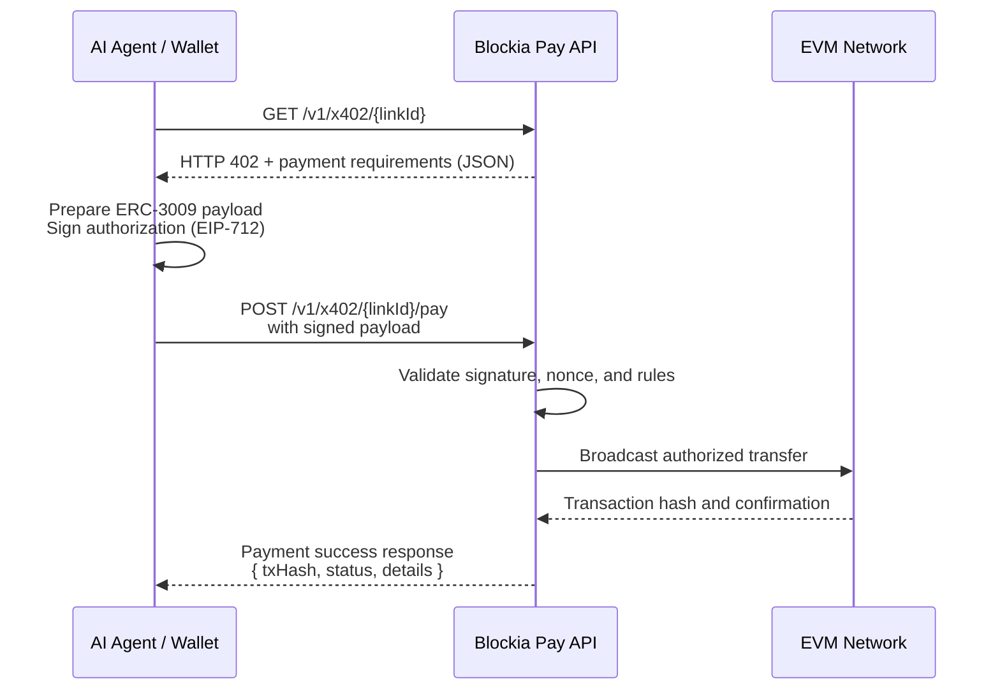

# X402 Protocol Overview

Blockia Pay implements the X402 payment protocol, enabling gasless, secure, and
efficient USDC payments using ERC-3009 authorized transfers. The protocol is
designed for AI agents, automation tools, and seamless payment experiences, with
a focus on machine-readable requirements and robust security.

## What is X402?

X402 is a payment protocol that combines:

- **ERC-3009**: Authorized token transfers for gasless payments
- **Account Abstraction**: Smart accounts with passkey authentication
- **Cross-chain compatibility**: Support for multiple blockchain networks
- **AI-friendly**: Designed for automated payment processing

## Key Features

### ⚡ Gasless Payments

- No gas fees for payers
- Merchant-sponsored transactions
- Seamless user experience

### 🔐 Authorized Transfers

- ERC-3009 compliant signatures
- Secure off-chain authorization
- On-chain settlement

### 🤖 AI Agent Compatible

- Machine-readable payment requirements
- Structured API responses
- Automated payment processing

## Protocol Flow



## Integration Examples For AI Agents

```typescript
import { BlockiaAgent } from "@blockia-pay/blockia-agent-sdk";

const agent = new BlockiaAgent({
  privateKey: "0x...",
  apiUrl: "http://localhost:3000/",
  chainId: 84532,
});

console.log(`🔑 Signer address: ${agent.getSignerAddress()}`);
console.log("");

console.log("📡 Fetching payment requirements...");
const requirementsResponse = await agent.getPaymentLinkInfo(linkId);

console.log("🚀 Processing payment...");
const result = await agent.makePayment(requirementsResponse.accepts);
```

## API Endpoints

- `GET /v1/x402/{linkId}` — Get payment requirements (returns 402)
- `POST /v1/x402/{linkId}/pay` — Submit payment payload

## Business Rules & Error Handling

- Only active, non-expired payment links are payable
- Only USDC on supported networks is accepted (Base, Base Sepolia)
- Nonce must be unique and unused
- Signature must be valid EIP-712 (ERC-3009)
- Amount must match the requirement
- Validity window (`validAfter`, `validBefore`) enforced

### Error Codes

- `402 Payment Required`: Payment requirements included
- `400 Bad Request`: Invalid payload, signature, or parameters
- `403 Forbidden`: Unauthorized or invalid payment attempt
- `409 Conflict`: Nonce already used or duplicate payment
- `404 Not Found`: Link does not exist
- `500 Internal Server Error`: Server-side error

Error responses include a machine-readable `error` field and message.
